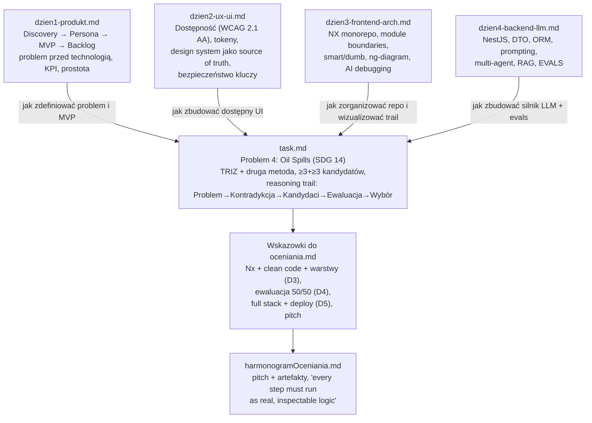
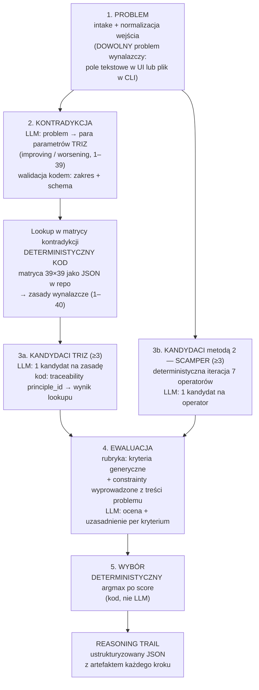
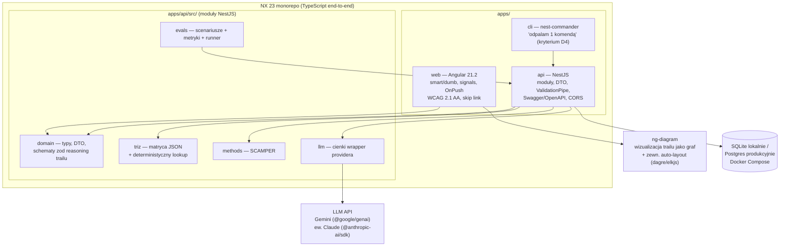
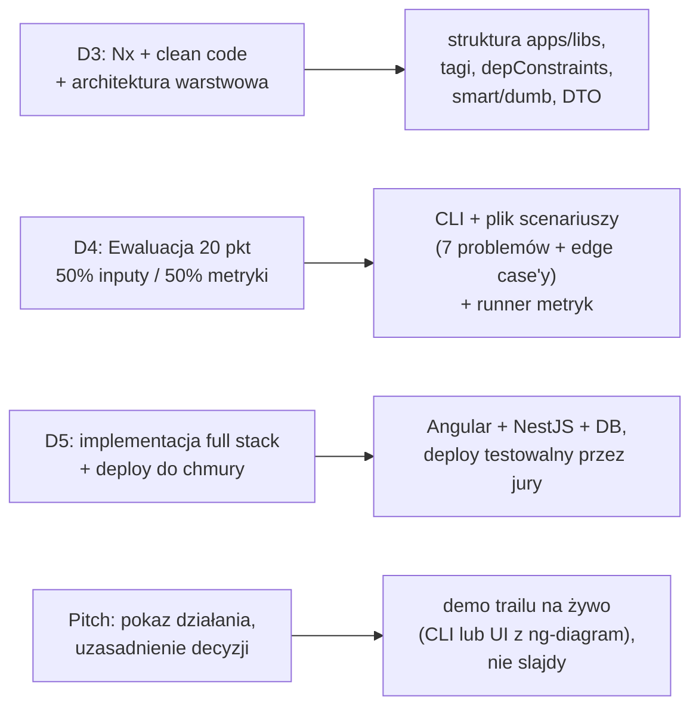

# Graf wiedzy — Build with AI Wrocław (hackathon)

> Synteza plików z `docs/` w formie grafów (Mermaid). Źródła prawdy: `task.md`, `dzien1-produkt.md`, `dzien2-ux-ui.md`, `dzien3-frontend-arch.md`, `dzien4-backend-llm.md`, `Wskazowki do oceniania.md`, `harmonogramOceniania.md`.

---

## 1. Mapa dokumentów — co z czego wynika

---

## 2. Graf pipeline'u systemu (to, co budujemy)

Każdy węzeł = osobny, inspektowalny krok logiki (wymóg z `task.md` i `harmonogramOceniania.md`). Zasada z oceniania Dnia 4: **kodem to, co policzalne; LLM tylko do subiektywnego.**

---

## 3. Graf stacku technicznego

---

## 4. Technologie: wymagane vs proponowane

### Wynikające z materiałów (nie zmieniamy)

| Technologia | Skąd | Rola |
| --- | --- | --- |
| NX 23 | dzień 3/4 (kryterium oceny D3) | monorepo, tagi, module boundaries |
| Angular 21.2 | dzień 4 (NX 23 wymusza wersję) | frontend |
| NestJS | dzień 4 | backend/API, silnik pipeline'u |
| TypeScript | dzień 4 | end-to-end |
| ng-diagram | dzień 3 („będzie używana na hackathonie") | wizualizacja reasoning trailu (node/edge) |
| Postgres / SQLite | dzień 4 | historia uruchomień (prod / lokalnie) |
| Docker Compose | dzień 4 | reprodukowalna baza |
| Swagger / OpenAPI | dzień 4 | dokumentacja i testowanie API |
| TypeORM lub Prisma | dzień 4 (wspomniane) | ORM, `synchronize=false` |

### Proponowane dodatkowo (do akceptacji)

| Biblioteka | Po co | Uzasadnienie |
| --- | --- | --- |
| `zod` | walidacja outputów LLM na granicy każdego kroku | „every step must run as real, inspectable logic" — schema per krok, kod łapie halucynacje |
| `@google/genai` (Gemini) | klient LLM | event GDG/Google, darmowe tokeny; wrapper providera pozwala podmienić na Claude |
| `nest-commander` | CLI w tym samym kodzie co API | kryterium D4: „odpalam 1 komendą"; zero duplikacji silnika |
| `@dagrejs/dagre` lub `elkjs` | auto-layout grafu | dzień 3 wprost: ng-diagram **nie ma** auto-layoutu — potrzebna zewnętrzna paczka |
| `@nestjs/config` + `.env` | konfiguracja i sekrety | dzień 2/3: klucze API nigdy w repo ani w prompcie agenta |
| Jest/Vitest (default NX) | testy jednostkowe lookupu i selektora | deterministyczne kroki muszą mieć unit testy (whitebox przed blackbox, dzień 4) |

---

## 5. Graf kryteriów oceny → elementy systemu

